# 🛡️ Awesome AI Guardrails

<p align="center">
  
</p>

<p align="center">
  <a href="https://github.com/ishandutta2007/Awesome-Awesome-Awesome"></a>
  <a href="https://discord.gg/jc4xtF58Ve"></a>
  <a href="https://opensource.org/licenses/MIT"></a>
  <a href="http://makeapullrequest.com"></a>
  <a href="https://github.com/ishandutta2007"></a>
</p>

---

## 🚀 Overview & Ecosystem

Welcome to **Awesome AI Guardrails** — the definitive curated list of commercial **SaaS products** and **open-source GitHub projects** dedicated to **AI Guardrails**, **LLM Security**, **Prompt Injection Defense**, **Policy Enforcement**, and **Runtime Safety Controls**.

As Large Language Models (LLMs) and autonomous AI agents are deployed into production, implementing robust guardrail mechanisms is essential to prevent jailbreaks, restrict unapproved topic drift, validate structured inputs/outputs, eliminate PII leaks, and enforce enterprise safety policies at runtime.

---

## 📌 Table of Contents

- [📊 Market Size & Industry Overview](#-market-size--industry-overview)
- [🏢 SaaS & Hosted Commercial Platforms](#-saas--hosted-commercial-platforms)
- [🔓 Open-Source GitHub Repositories](#-open-source-github-repositories)
- [🛠️ Guardrail Architectural Patterns](#%EF%B8%8F-guardrail-architectural-patterns)
- [🤝 How to Contribute](#-how-to-contribute)
- [⚠️ Disclaimer](#%EF%B8%8F-disclaimer)
- [📈 Star History](#-star-history)
- [💖 Support & Community](#-support--community)

---

## 📊 Market Size & Industry Overview

> 💡 **Market Size & Dynamics**: The global **AI Guardrails and AI Security market** is estimated at **$3.8 Billion by 2030** (expanding at a CAGR of ~34.2%). The sector is currently **highly fragmented**, with agile security startups competing alongside open-source framework ecosystems and cloud infrastructure providers.

---

## 🏢 SaaS & Hosted Commercial Platforms

Below is a curated table of leading commercial SaaS products offering managed AI guardrails, security scanners, and runtime policy enforcement. *Sorted by Company Size / Funding / Valuation (Descending).*

| Product / Platform | Company Valuation / Funding | Starting Pricing | Free Tier / Trial Limit | Key Focus & Security Capabilities |
| :--- | :--- | :--- | :--- | :--- |
| 🟢 **[NVIDIA NeMo Guardrails Enterprise](https://www.nvidia.com/en-us/ai-data-science/)** | ~$3.3 Trillion (Market Cap) | $4,500 / GPU / year | 90-day Free Trial (NVIDIA AI Enterprise) | Enterprise-grade Colang policy engine, retrieval rails, dialog trajectory constraints, and safety filters. |
| 🛡️ **[Protect AI Platform](https://protectai.com/)** | $185M+ Total Funding | $500 / month (Developer Plan) | Free Community Edition (10,000 security scans/mo) | End-to-end AI application security suite, LLM Guard pipeline, model vulnerability scanner, and guardrails. |
| 👁️ **[Fiddler AI](https://www.fiddler.ai/)** | $65M+ Total Funding | $250 / month (Starter Plan) | 14-day Free Trial (1M monitored tokens included) | Enterprise LLM observability, runtime guardrails, hallucination scoring, and compliance tracking. |
| ⚡ **[Arthur Shield](https://www.arthur.ai/)** | $60M+ Total Funding | $350 / month (Pro Plan) | 14-day Free Trial (up to 25,000 API calls) | Real-time firewall for LLM apps, prompt injection detection, PII extraction prevention, and data leakage defense. |
| 🔒 **[HiddenLayer AISec Platform](https://hiddenlayer.com/)** | $56M+ Total Funding | $1,200 / month (Team Plan) | 30-day Free Trial (includes 5 full model scans) | AI threat detection engine, model posture management, automated payload inspection, and safety guardrails. |
| 🎯 **[Aporia AI Guardrails](https://www.aporia.com/)** | $40M+ Total Funding | $99 / month (Starter Plan) | Free Tier (up to 10,000 requests/mo forever) | Ultra-fast (<50ms latency) guardrail proxy, toxic output prevention, prompt injection mitigation, and policy rules. |
| 🏰 **[Lakera Guard](https://www.lakera.ai/)** | $30M+ Total Funding | $150 / month ($0.002 / request) | Free Tier (up to 10,000 requests/mo forever) | Dedicated prompt injection defense API, jailbreak security intelligence, and real-time LLM input filtering. |
| 📋 **[Credo AI](https://www.credo.ai/)** | $21M+ Total Funding | $450 / month (Essentials Tier) | 30-day Free Trial (Full Risk Assessment Workspace) | AI governance platform, safety guardrail policy mapping, regulatory compliance, and risk auditing. |
| 🔬 **[Patronus AI](https://www.patronus.ai/)** | $20M+ Total Funding | $299 / month (Growth Tier) | 14-day Free Trial (5,000 evaluation credits) | Automated LLM evaluator APIs, guardrail bench testing, hallucination benchmarking, and safety scoring. |
| 🧱 **[Guardrails AI Cloud](https://www.guardrailsai.com/)** | $7.5M+ Seed Funding | $49 / month (Pro Cloud) | Free Tier (up to 1,000 serverless validations/mo) | Hosted Guardrails Hub execution, custom validator store, and structured JSON output validation. |

---

## 🔓 Open-Source GitHub Repositories

Open-source frameworks provide transparent, highly customizable guardrails for self-hosted or cloud model deployments. *Sorted by GitHub Star Count (Descending).*

1. 🌟 **[microsoft/guidance](https://github.com/microsoft/guidance)** <a href="https://github.com/microsoft/guidance/stargazers"></a>  
   A domain-specific language for controlling modern LLMs—interleave generation, prompt structure, and token-level logical constraints seamlessly.

2. 🧪 **[promptfoo/promptfoo](https://github.com/promptfoo/promptfoo)** <a href="https://github.com/promptfoo/promptfoo/stargazers"></a>  
   CLI and developer library to evaluate, red-team, and test LLM guardrail policies, prompt injection vulnerabilities, and safety regressions.

3. 📏 **[confident-ai/deepeval](https://github.com/confident-ai/deepeval)** <a href="https://github.com/confident-ai/deepeval/stargazers"></a>  
   The open-source LLM evaluation framework designed to unit-test safety, hallucination rates, and guardrail validation rules like pytest.

4. 🤖 **[NVIDIA/NeMo-Guardrails](https://github.com/NVIDIA/NeMo-Guardrails)** <a href="https://github.com/NVIDIA/NeMo-Guardrails/stargazers"></a>  
   Leading open-source programmable guardrails engine—uses Colang policies for dialog pathing, topic controls, tool execution safety, and input/output filtering.

5. 🧱 **[guardrails-ai/guardrails](https://github.com/guardrails-ai/guardrails)** <a href="https://github.com/guardrails-ai/guardrails/stargazers"></a>  
   Declarative validation framework for LLM inputs and outputs with automatic corrective retries, PII filtering, and Hub validator modules.

6. ⚡ **[eth-sri/lmql](https://github.com/eth-sri/lmql)** <a href="https://github.com/eth-sri/lmql/stargazers"></a>  
   Declarative programming language for language model interaction featuring constrained decoding, data type safety, and inline guardrail assertions.

7. 🎯 **[leondz/garak](https://github.com/leondz/garak)** <a href="https://github.com/leondz/garak/stargazers"></a>  
   Generative AI Red-teaming & Assessment Kit—scans LLM applications for prompt injections, jailbreaks, data leakage, and toxic outputs.

8. 🛡️ **[protectai/llm-guard](https://github.com/protectai/llm-guard)** <a href="https://github.com/protectai/llm-guard/stargazers"></a>  
   Comprehensive security toolkit designed to scan, sanitize, and shield LLM prompts and completions against malicious payloads, PII leaks, and secret exposure.

9. 🪤 **[protectai/rebuff](https://github.com/protectai/rebuff)** <a href="https://github.com/protectai/rebuff/stargazers"></a>  
   Multi-layered prompt injection detection engine featuring heuristic analysis, vector db signature matching, and canary token leakage detection.

10. 🔥 **[meta-llama/llama-firewall](https://github.com/meta-llama/llama-firewall)** <a href="https://github.com/meta-llama/llama-firewall/stargazers"></a>  
    Open guardrail framework by Meta for agent defense—provides alignment inspection on reasoning steps, jailbreak detection, and code execution scanning.

11. 👁️ **[aisecros/vigil-llm](https://github.com/aisecros/vigil-llm)** <a href="https://github.com/aisecros/vigil-llm/stargazers"></a>  
    Python security scanner for detecting prompt injections, jailbreak patterns, and sensitive data leakage in LLM prompts and completions.

12. 🔰 **[akshaymagapu/aisafeguard](https://github.com/akshaymagapu/aisafeguard)** <a href="https://github.com/akshaymagapu/aisafeguard/stargazers"></a>  
    Lightweight AI safety proxy offering real-time prompt injection blocking, PII redaction, and drop-in OpenAI API compatibility.

---

## 🛠️ Guardrail Architectural Patterns

```
   [ User Prompt ]
          │
          ▼
┌───────────────────┐
│  Input Guardrail  │ ──► (Block Prompt Injection / Jailbreaks / PII)
└─────────┬─────────┘
          │ (Sanitized Prompt)
          ▼
┌───────────────────┐
│     LLM / Agent   │
└─────────┬─────────┘
          │ (Raw Completion)
          ▼
┌───────────────────┐
│ Output Guardrail  │ ──► (Validate Schema / Toxicity / Hallucinations)
└─────────┬─────────┘
          │
          ▼
   [ Safe Response ]
```

- **Input Filtering**: Scans user queries before hitting the model to prevent prompt injection, red-team attacks, and PII exposure.
- **Dialog & Topic Control**: Enforces fixed flow trajectories and prevents off-topic conversation drift using stateful policies.
- **Output Schema Validation**: Asserts structured JSON, SQL, or markdown formats with automated retries or fallback values.
- **Agent Tool Isolation**: Inspects tool invocation payloads and egress commands to prevent unauthorized agent actions.

---

## 🤝 How to Contribute

Contributions are warmly welcomed! Please follow these simple steps:

1. Fork the repository on GitHub.
2. Create a new topic branch (`git checkout -b feature/new-guardrail`).
3. Add your tool to `README.md` maintaining table/list formatting and alphabetical/star ordering rules.
4. Submit a Pull Request with a short summary of the product or project.

---

## ⚠️ Disclaimer

- This repository is a **community-curated list** for informational and educational purposes.
- Guardrails significantly lower operational risk, but no security system offers 100% protection against novel zero-day prompt injection or jailbreak techniques.
- Always implement defense-in-depth principles (least privilege, human-in-the-loop, and continuous red-teaming).

---

## 📈 Star History

[](https://star-history.dera.page/#ishandutta2007/Awesome-AI-Guardrails&type=date&legend=top-left)

---

## 💖 Support & Community

Thank you for exploring **Awesome AI Guardrails**! If you find this curated list helpful for building safe, secure, and production-ready AI applications:

- ⭐ **Star this repository** to help others discover it.
- 🍴 **Fork it** to add your own tools or keep a personal reference.
- 📢 **Share it** with fellow AI security researchers, engineers, and developers.
- ☕ **Buy me a coffee**: If you'd like to support ongoing maintenance and research, consider sponsoring via the [GitHub Sponsor Dashboard](https://github.com/sponsors/ishandutta2007).

---

<p align="center">
  <b>Maintained by <a href="https://github.com/ishandutta2007">Ishan Dutta</a></b> • <i>Building Safe & Trustworthy AI Systems</i>
</p>
